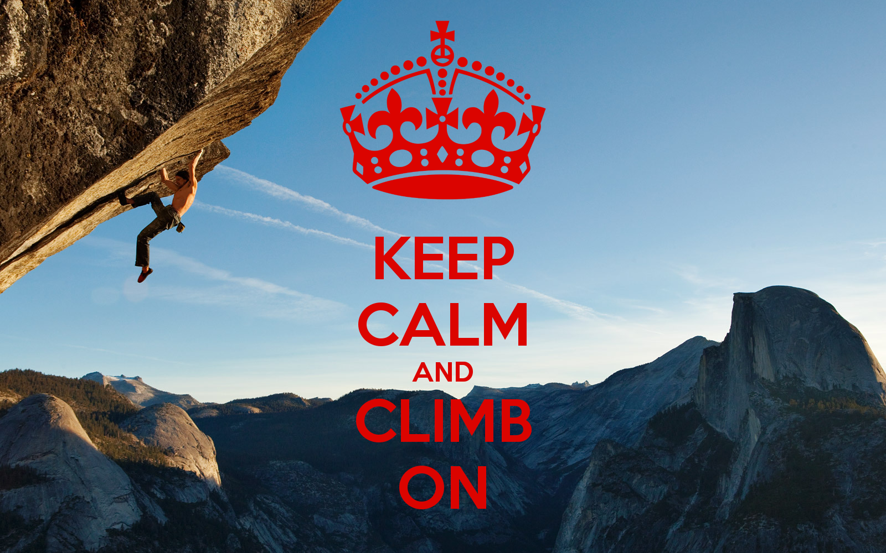
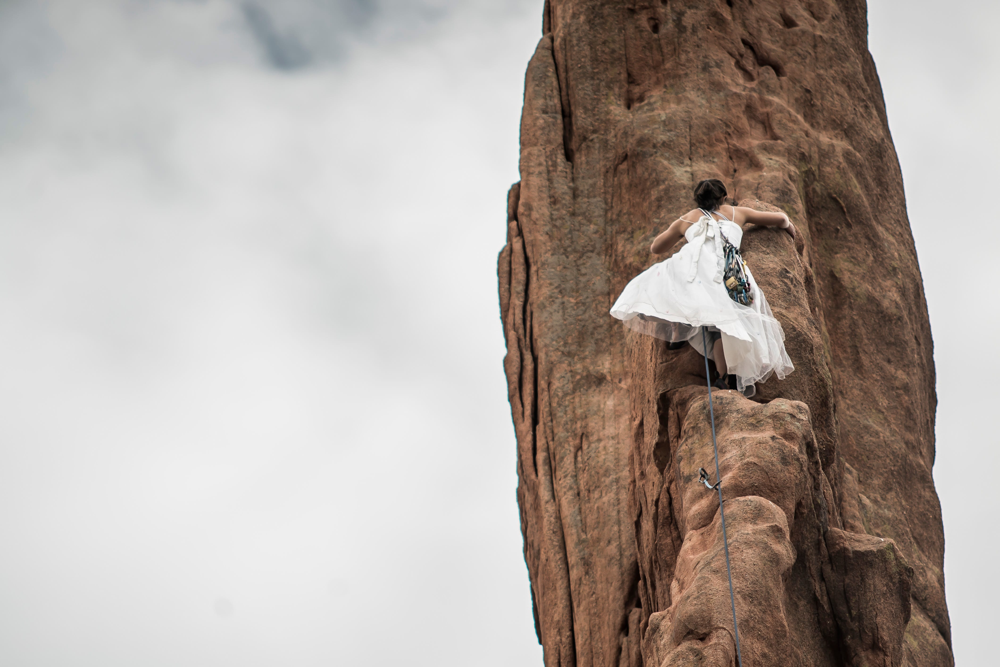
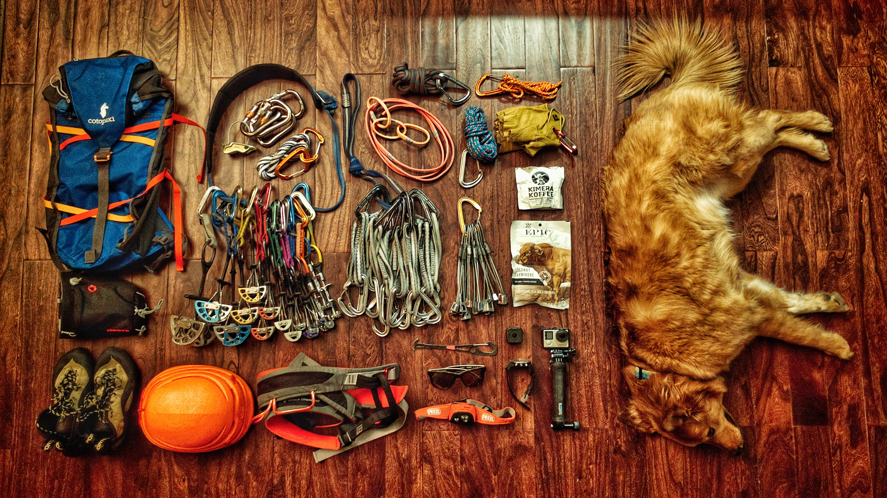
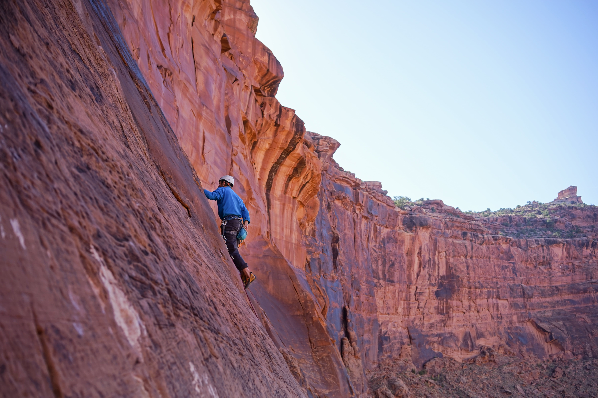

# Rock Climbing Open Source Guide

## About

This is a collection of free rock climbing tutorials on the web for those of you who are passionate about climbing and seeking to become a better climber. 

Whether you are a beginner with no experience at all or a veteran who has been climbing for years, I hope you can find something useful. 

You don't have to follow the order, you can choose whatever you want to learn.

**Keep calm and climb on.**

## Content
- [Introduction](#introduction)
- [Rock Climbing Gear](#rock-climbing-gear)
- [How to Tie Climbing Knots](#how-to-tie-climbing-knots)
- [How to Belay](#how-to-belay)
- [Understanding Climbing Grades](#understanding-climbing-grades)
- [Understanding Climbing Lingo](#understanding-climbing-lingo)
- [Top Rope Climbing](#top-rope-climbing)
- [Lead Climbing](#lead-climbing)
- [Bouldering](#bouldering)
- [Rock Climbing Technique](#rock-climbing-technique)
- [Rock Climbing Training](#rock-climbing-training)
- [Further Reading and Learning](#further-reading-and-learning)
- [How to collaborate](#how-to-collaborate)

## Introduction

[How to rock climb](http://www.howcast.com/guides/1108-how-to-rock-climb/)

[Rock Climbing for Beginners - Introduction To Rock Climbing](https://www.youtube.com/watch?v=gLfvk2SSj1c&t=4s)

[The 10 Things You Need to Know Before You Go Rock Climbing](http://greatist.com/move/rock-climbing-tips)

[The Beginner's Guide to Rock Climbing](https://www.outsideonline.com/2062326/beginners-guide-rock-climbing)

[How to Rock Climb – The Beginners Guide](http://expertenough.com/690/rock-climbing)

[How to Get Started: 10 Pro Tips for Rock-Climbing Beginners](http://www.popularmechanics.com/adventure/outdoors/a9412/how-to-get-started-10-pro-tips-for-rock-climbing-beginners-15837589/)

## Rock Climbing Gear

[How to Dress for Indoor Rock Climbing](http://www.howcast.com/videos/512708-how-to-dress-for-indoor-climbing-rock-climbing/)

[Rock Climbing for Beginners - Rock Climbing Gear](https://www.youtube.com/watch?v=tXwV0YD222g)

### Shoes

[How to Choose Climbing Shoes](https://www.youtube.com/watch?v=jBa5TuXjHOE)

[How To Pick The Perfect Climbing Shoe For You](https://www.youtube.com/watch?v=iTSr3VpFP_I)

[Climbing Technique For Beginners - Episode - 4 - Shoes](https://www.youtube.com/watch?v=QBxukNzgjDg&t=101s)

### Rope

### Belay Device

[How to Pick the Right Belay Device for Indoor Climbing](http://www.howcast.com/videos/512711-how-to-pick-the-right-belay-device-rock-climbing/)

### Harness

[How to fit a climbing harness](http://www.howcast.com/videos/512683-how-to-fit-a-climbing-harness-rock-climbing/)

[How to Choose a Climbing Harness](https://www.youtube.com/watch?v=aRrLfR7rnw0&t=2s)

[How to Pick the Right Harness for Indoor Climbing](http://www.howcast.com/videos/512710-how-to-pick-the-right-harness-rock-climbing/)

[What Is The Best Entry-Level Climbing Harness?](https://www.youtube.com/watch?v=4qFu-_ctkuY)

### Carabiners

[Intro to Carabiners](https://www.youtube.com/watch?v=llUg6LhvryE&index=45&list=PLfVXwulLSGHqGu3VtYKyQTxkOw-wBwRUq)

[How to Pick the Right Carabiners for Indoor Climbing](http://www.howcast.com/videos/512712-how-to-pick-the-right-carabiners-rock-climbing/)

[How to Choose Carabiners](https://www.youtube.com/watch?v=T8f_YnQGzA8)

[What's The Best Carabiner For Use With Belay Devices?](https://www.youtube.com/watch?v=Mb5x_2CNkEk)

[All the Belay Devices Coming in 2017 - Black Diamond, Edelrid, Petzl, Wild Country](https://www.youtube.com/watch?v=xyGzwPBUszg)

### Quick Draws

### Helmet 

### Chalk

[Climbing Tips: Chalking Up](https://www.youtube.com/watch?v=Xzu2Cy-Aets)

[How to Use Chalk for Indoor Climbing](http://www.howcast.com/videos/512682-how-to-use-chalk-for-indoor-climbing-rock-climbing/)

## How to Tie Climbing Knots

[How to Tie Figure 8 Follow-Through Knot for Indoor Climbing](http://www.howcast.com/videos/512684-how-to-tie-figure-8-follow-through-knot-rock-climbing/)

[How to Tie the Figure 8 Follow Through Loop](https://www.youtube.com/watch?v=aLopeVBb7yU&feature=youtu.be)

## How to Belay

[How to Set Up a Top-Rope Belay for Indoor Climbing](http://www.howcast.com/videos/512685-how-to-set-up-a-top-rope-belay-rock-climbing/)

[How to Use Proper Top-Rope Belay Method for Indoor Climbing](http://www.howcast.com/videos/512686-how-to-use-proper-top-rope-belay-method-rock-climbing/)

[How to Lower a Climber in Top-Rope Belay](http://www.howcast.com/videos/512687-how-to-lower-climber-in-top-rope-belay-rock-climbing/)

[How to Use an Auto-Belay Device for Indoor Climbing](http://www.howcast.com/videos/512690-how-to-use-an-auto-belay-device-rock-climbing/)

[How to belay the leader with a REVERSO](https://www.youtube.com/watch?v=ymJb6tW5_BE&index=7&list=PLfVXwulLSGHqGu3VtYKyQTxkOw-wBwRUq)

[How to belay the leader with a GRIGRI](https://www.youtube.com/watch?v=FHdqjjyeTtg&list=PLfVXwulLSGHqGu3VtYKyQTxkOw-wBwRUq&index=6)

[The World's Worst Belayer](https://www.youtube.com/watch?v=V9hsWjA3SmU)

[Rock Climbing: How to Belay](https://www.youtube.com/watch?v=CFIz4cBFVro)

[Setting Up As The Belayer](https://www.youtube.com/watch?v=m-FbtppVC7w)

## Understanding Climbing Grades
[Understanding Climbing Grades](http://www.climbing.com/skills/unsent-understanding-climbing-grades/)

[How to Understand Indoor Climbing Grades](http://www.howcast.com/videos/512706-how-to-understand-climbing-grades-rock-climbing/)

## Understanding Climbing Lingo
[How to Use Commands before Top-Rope Climbing](http://www.howcast.com/videos/512688-using-commands-before-top-rope-climbing-rock-climbing/)

[How to Use Commands during Top-Rope Climbing](http://www.howcast.com/videos/512689-using-commands-during-top-rope-climbing-rock-climbing/)

[How to Understand Climbing Terminology](https://www.youtube.com/watch?v=nUJAI7CuRO0&index=2&list=PLfVXwulLSGHqGu3VtYKyQTxkOw-wBwRUq)

[How to Understand Indoor Rock Climbing Terminology](http://www.howcast.com/videos/512713-how-to-understand-climbing-terminology-rock-climbing/)

## Top Rope Climbing

## Lead Climbing 

[Lead Climbing](https://www.youtube.com/watch?v=q4rVY3sLQqA)

[How to Clip on Lead for Indoor Rock Climbing](http://www.howcast.com/videos/512694-how-to-clip-on-lead-for-indoor-climbing-rock-climbing/)

[How to Lead Belay for Indoor Rock Climbing](http://www.howcast.com/videos/512695-how-to-lead-belay-for-indoor-climbing-rock-climbing/)

[How to Take & Catch a Lead Fall for Indoor Climbing](http://www.howcast.com/videos/512696-how-to-take-catch-a-lead-fall-rock-climbing/)

[5 Tips for Lead Climbing in Indoor Rock Climbing](http://www.howcast.com/videos/512697-5-tips-for-lead-climbing-rock-climbing/)

[How to Spot for Indoor Rock Climbing](http://www.howcast.com/videos/512698-how-to-spot-for-indoor-climbing-rock-climbing/)

[Rock Climbing: Lead Fall](https://www.youtube.com/watch?v=RJZ8OxYP5T4)

[Rock Climbing: Building a Top-Rope Anchor Using the Quad](https://www.youtube.com/watch?v=9liByriQRag)

[Rock Climbing: Cleaning a Top Rope Anchor](https://www.youtube.com/watch?v=NMSTNq6SZV0)

### REI

[Rock Climbing: Lead Belay](https://www.youtube.com/watch?v=S_F1MfVGOzk)

## Bouldering

[Bouldering](https://www.youtube.com/watch?v=ddSTXPZuff8)

[5 Advanced Bouldering Techniques for Indoor Climbing](http://www.howcast.com/videos/512700-5-advanced-bouldering-techniques-rock-climbing/)

[6 Bouldering Safety Tips for Indoor Rock Climbing](http://www.howcast.com/videos/512703-6-bouldering-safety-tips-rock-climbing/)

## Rock Climbing Technique

### Finger

[Climbing Technique For Beginners - Episode 2 - Hand Placement](https://www.youtube.com/watch?v=G634356Sti0)

[Rock Climbing: How to Climb Finger Cracks](https://www.youtube.com/watch?v=jzdgWsbGbMc)

[Rock Climbing: How to Jam Hand Cracks](https://www.youtube.com/watch?v=l4EzbCLfUkc)

### Foot work

[Climbing Technique For Beginners - Episode 1- Foot Placement](https://www.youtube.com/watch?v=oqd39cc0HL0)

[How to Use Heel & Toe Hooks for Indoor Climbing](http://www.howcast.com/videos/512699-how-to-use-heel-toe-hooks-rock-climbing/)

[Climbing Expert Advice: Foot position](https://www.youtube.com/watch?v=jhyyDBSnyUk)

### Balance 

[Climbing Expert Advice: Balance training](https://www.youtube.com/watch?v=4lyMr6LT9wM)

[Climbing Expert Advice: Rest position](https://www.youtube.com/watch?v=uoJBE-zRdKY)

[5 Tips for Better Balance](http://www.climbing.com/skills/5-tips-for-better-climbing-balance/)

[Climbing Technique For Beginners - Episode 5 - Hips](https://www.youtube.com/watch?v=jbj7XMLOWgE&t=196s)

### Climbing Holds

[How to Grip Indoor Climbing Holds](http://www.howcast.com/videos/512681-how-to-grip-indoor-climbing-holds-rock-climbing/)

[Rock Climbing: Climbing Holds](https://www.youtube.com/watch?v=9CuByOqafxA)

### Dyno

[Static vs. Dynamic Movement in Indoor Rock Climbing](http://www.howcast.com/videos/512701-static-vs-dynamic-movement-rock-climbing/)

[How to Do a Dyno in Indoor Rock Climbing](http://www.howcast.com/videos/512702-how-to-do-a-dyno-in-indoor-climbing-rock-climbing/)

[Climbing Technique For Intermediate - Episode 1 - Dynos](https://www.youtube.com/watch?v=XjUsX8X9XGw)

### Rappel

[Rock Climbing: How to Rappel](https://www.youtube.com/watch?v=7U6tdEevJgs)

### Misc

[Being The Climber](https://www.youtube.com/watch?v=QfTIUKyqCWc)

[5 Fundamentals of Indoor Rock Climbing](http://www.howcast.com/videos/512680-5-Fundamentals-of-Indoor-Rock-Climbing-Rock-Climbing/)

[Climbing Technique 1](https://www.youtube.com/watch?v=jbIDnMmSLsc)

[Climbing Technique 2](https://www.youtube.com/watch?v=gkMngYYadjE)

[Rock Climibng: Climbing Moves](https://www.youtube.com/watch?v=iazQou-36sE)

[Rock Climbing: Climbing Techniques](https://www.youtube.com/watch?v=GdvmNTZzYZ4)

[How to Understand Indoor Rock Climbing Sequencing](http://www.howcast.com/guides/1108-how-to-rock-climb/)

[How to Solve Rock Climbing Problems Based on Body Type](http://www.howcast.com/videos/512707-solving-problems-based-on-body-type-rock-climbing/)

[Injury free movement for rock climbers](http://www.climbing.com/skills/injury-free-movement-for-rock-climbers/)

[Climbing Technique For Beginners - Episode 3- Gym Routine](https://www.youtube.com/watch?v=q9fU-maafMQ)

## Rock Climbing Training

[How to Use a Campus Board for Indoor Rock Climbing](http://www.howcast.com/videos/512714-how-to-use-a-campus-board-rock-climbing/)

[How to Use a Hangboard for Indoor Climbing](http://www.howcast.com/videos/512715-how-to-use-a-hangboard-rock-climbing/)

[Indoor Climbing Safety Guidelines & Etiquette](http://www.howcast.com/videos/512704-indoor-climbing-safety-etiquette-rock-climbing/)

[Matthew Childs 9 Rules of Rock Climbing](https://www.ted.com/talks/matthew_childs_9_rules_of_rock_climbing#t-31881)

[Forearm Stretching Exercise And Wrist Exercise](https://www.youtube.com/watch?v=TeEvXluMFRs)

[My Warm Up Routine For Climbing](https://www.youtube.com/watch?v=l7_1dHQJsyw&t=188s)

[Rock Climbing Warmup and Flexibility Boost](https://www.youtube.com/watch?v=hHn9g7rJ4o8)

## Further Reading and Learning

[Dosage the Complete Box Set](https://goo.gl/C68p8J)

http://www.alpineinstitute.com/

### Films

[Valley Uprising - ](https://www.youtube.com/watch?v=o86TpaSBcWw)
Generations of beatniks and madmen drop out of society and take up a life of rock climbing on the massive granite walls of Yosemite National Park.

[Reel Rock Film Tour - ](http://www.reelrocktour.com/)
The REEL ROCK Film Tour brings the best climbing and adventure films of the year to live audiences throughout the world.

[Sender Films](http://senderfilms.com/)

### Talks

[What are you up against? - Tommy Caldwell](https://www.youtube.com/watch?v=PnMs_qLwaes)

### Books

[Climbing Guidebooks](https://www.rei.com/c/climbing-guidebooks?r=c&ir=category%3Aclimbing-guidebooks&page=1)

## How to Collaborate

If you find any mistakes, broken link or you want to suggest a new resource, don't hesitate to send me an 
<a href="mailto:nerohoop@gmail.com">email</a>. You can also summit any interesting articles, books, videos, apps.

I'd love to hear from you how I can improve this guide to help more and more climbers. 

**Any Feedback is welcome**

## Community

Join our chat room! 

